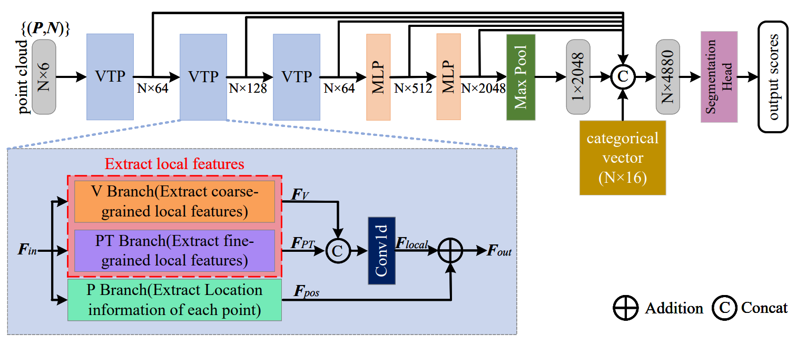
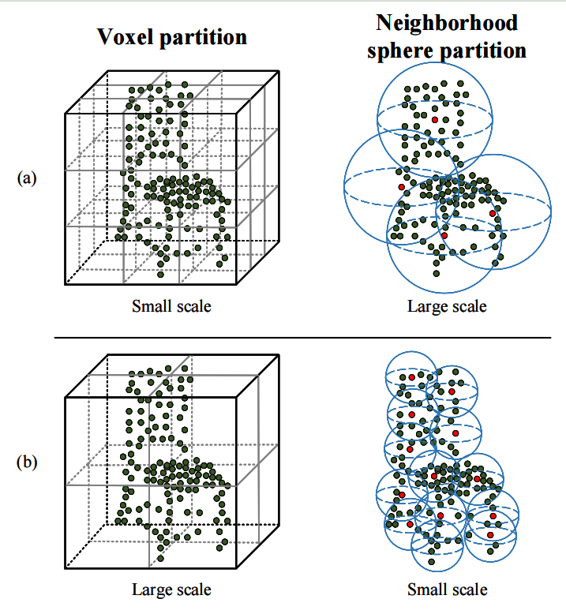
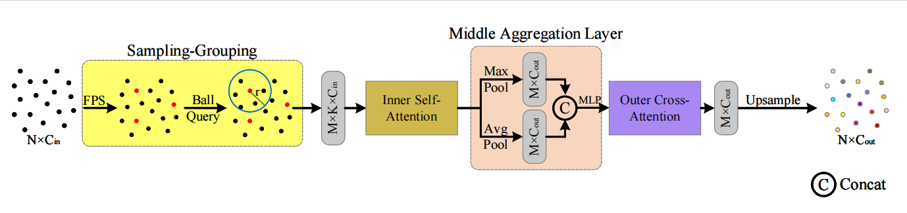
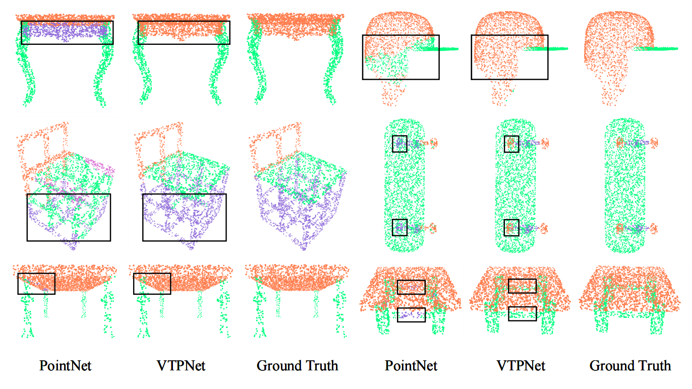
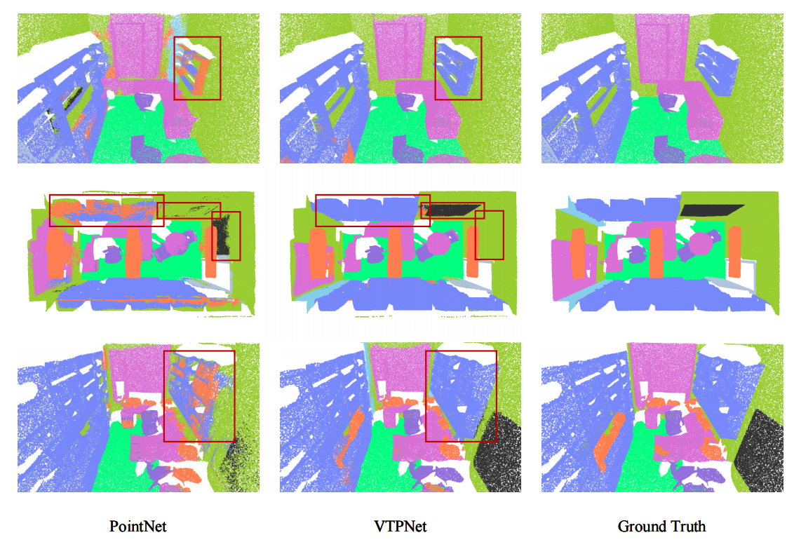

# VTPNet

## VTPNet for 3D deep learning on point cloud

According to the types of feature, the existing point cloud learning methods can be roughly divided into two categories: point-based and voxel-based methods. Most of the point-based methods generate the single features for each point by MLP, while the voxel-based methods calculate the neighborhood features for each local voxel cubic through 3D CNN, which leads to the features to be extremely fine-grained or coarse-grained. In addition, most of the previous point cloud learning methods only learn multi-scale information with a single feature type, lacking multi-scale information composed of different types of features. To address the above issues, we firstly propose a Voxel-Transformer-Point (VTP) Block to generate features that are neither too fine-grained nor too coarse-grained. VTP consists of Voxel-Based Branch (V branch), Point-Based Transformer Branch (PT branch) and Point-Based Branch (P branch). From the V branch to the PT branch, and then to the P branch, their extracted features are becoming increasingly refined. The V branch extracts the coarse-grained features of the point cloud through low voxel resolution; the PT branch obtains the fine-coarse-grained features (neither too fine nor too coarse) of the point cloud by calculating the self-attention in the local neighborhood and cross-attention between the neighborhoods; the P branch uses a simplified MLP network to generate location information of each point. Moreover, to enrich the local features of point clouds with different scales over different features types, we set the voxel scale in the V branch and the neighborhood sphere scale in the PT branch to one large and one small (large voxel scale & small neighborhood sphere scale or small voxel scale & large neighborhood sphere scale). Finally, we use VTP as the feature extraction network to construct a VTPNet for point cloud learning, and performs shape classification, part segmentation, and semantic segmentation tasks on the ModelNet40, ShapeNet Part, and S3DIS datasets. 

### VTPNet deep learning network (ShapeNet Part)
<div  align="center">    
 
</div>

### Strategy "One large and one small" enriches local features of point cloud at different scales
<div  align="center">    
 
</div>

### Point-Based Transformer Branch
<div  align="center">    
 
</div>

## 1. Requirements

- PyTorch >=1.7.0
- python >= 3.7
- CUDA >= 9.0
- GCC >= 4.9
- torchvision

```
pip install -r requirements.txt
```

## 2. Datasets

### ModelNet40

To use normal features for classification: You can get our sampled point clouds of ModelNet40 (XYZ and normal from mesh, 10k points per shape) [here (1.6GB)](https://shapenet.cs.stanford.edu/media/modelnet40_normal_resampled.zip). Set dataset path in [configs\modelnet\modelnet.yaml](configs\modelnet\modelnet.yaml)

### ShapeNet

We follow the data pre-processing in [PointNet2](https://github.com/charlesq34/pointnet2). Please run the following
command to down the dataset
```bash
./data/shapenet/download.sh
```
Set dataset path in [configs\shapenet\\\_\_init_\_.py](configs\shapenet\__init__.py)

### S3DIS

We follow the data pre-processing in [PointCNN](https://github.com/yangyanli/PointCNN).
The code for preprocessing the S3DIS dataset is located in [`data\s3dis\`](data/s3dis/prepare_data.py).
One should first download the dataset from [here](http://buildingparser.stanford.edu/dataset.html), then run 
```bash
python data/s3dis/prepare_data.py -d [path to unzipped dataset dir]
```
Set dataset path in [configs\s3dis\\_\_init\_\_.py](configs/s3dis/__init__.py)

## 3. Results of VTPNet on Each Dataset

### 3D object classification
|Method|mAcc(%)|OA(%)|
|:----:|:----:|:-----:|
|VTPNet|90.1|93.2|

### Part Segmentation
|Method| mIoU(%)|airplane|bag|cap|car|chair|earphone|guitar|knife|lamp|laptop|motorbike|mug|pistol|rocket|skateboard|table|
|:----:|:-----:|:-----:|:---:|:---:|:---:|:---:|:---:|:---:|:---:|:---:|:---:|:---:|:---:|:---:|:---:|:---:|:---:|
|VTPNet|85.8|84.4|87.5|85.6|79.8|91.2|74.1|91.2|84.8|84.5|96.0|76.1|95.4|82.8|61.3|77.9|82.9|
### Scene Semantic Segmentation (6-fold Cross-Validation)

|Method|miou|celling|floor|wall|beam|column|window|door|table|chair|sofa|bookcase|board|clutter|
|:----:|:----:|:----:|:----:|:----:|:----:|:----:|:----:|:----:|:----:|:----:|:----:|:----:|:----:|:----:|
|VTPNet|66.3|94.2|97.4|81.8|58.3|43.0|63.7|67.8|70.5|72.9|43.3|58.9|51.2|59.4|

## 3. VTPNet for Classification and Segmentation

### 3D object classification

To train VTPNet on ModelNet40, one need to first set __test__ in `configs\modelnet\modelnet.yaml` to False, then run
```
python train_modelnet.py --config configs\modelnet\modelnet.yaml
```
To evaluate VTPNet on ModelNet40, one need to first set __test__ in `configs\modelnet\modelnet.yaml` to True, then run
```
python train_modelnet.py --config configs\modelnet\modelnet.yaml
```

### Part Segmentation

To train VTPNet on ShapeNet, one can run
```
python train_shapenet.py configs\shapenet\vtpnet\c1.py --devices 0,1
```
To evaluate VTPNet on ShapeNet, one can run
```
python train_shapenet.py configs\shapenet\vtpnet\c1.py --devices 0,1 --evaluate
```
Visualize the segmentation results of the model, one can run
```
python train_shapenet.py configs\shapenet\vtpnet\c1.py --devices 0,1 --evaluate --visual
```
**NOTE**: The. obj point cloud file will be generated in the __visual_out_shapenet__ folder and can be opened using the Meshlab software.

### Scene Semantic Segmentation

To train VTPNet on S3dis (holding out Area 5), one can run
```
python train_s3dis.py configs\s3dis\vtpnet2\area5\c1.py --devices 0,1
```
To evaluate VTPNet on ShapeNet, one can run
```
python train_s3dis.py configs\s3dis\vtpnet2\area5\c1.py --devices 0,1 --evaluate
```
Visualize the segmentation results of the model, one can run
```
python train_s3dis.py configs\s3dis\vtpnet2\area5\c1.py --devices 0,1 --evaluate --visual
```
**NOTE**: The. obj point cloud file will be generated in the __visual_out_s3dis__ folder and can be opened using the Meshlab software.

## Visualization Results Display
### Part segmentation
<div  align="center">    
 
</div>

### Scene Semantic Segmentation
<div  align="center">    
 
</div>

## Acknowledgement

Our codes are built upon [PVCNN](https://github.com/mit-han-lab/pvcnn), [Pointnet2_PyTorch](https://github.com/erikwijmans/Pointnet2_PyTorch) and [Pointnet_Pointnet2_pytorch](https://github.com/yanx27/Pointnet_Pointnet2_pytorch)